**Author:** Felix Doan  

---

> Build a self-hosted automation workflow with n8n to fetch news from an RSS feed, summarize the content with AI, and send the result to your personal Telegram.

## 1. Summary (TL;DR)

This article documents the process of building a basic automation workflow in n8n with the following model:

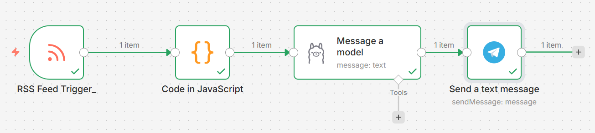

The goal of the flow is to:
- monitor an official RSS feed,
- extract the important fields from new articles,
- summarize the content using AI running through self-hosted Ollama,
- send the summary to a personal Telegram account.

The initial version used a test source to validate the technical setup, then it was updated to the official BBC feed for more stable real-world use.

## 2. Practice Goal

The goal of this first hands-on exercise with n8n is not to build a complex system, but to understand the 4 core parts of workflow automation:

- **Trigger:** what starts the flow.
- **Data transformation:** how data is cleaned and reduced as it passes through each node.
- **AI processing:** how content is sent to a model for processing.
- **Delivery:** where the final result is sent.

The specific use case here is to monitor news from an RSS feed, extract the most important fields, summarize it with AI, and send it to Telegram so the user receives automated updates.

## 3. Scope

The current workflow focuses on a minimal but complete use case:

- running on **self-hosted n8n**,
- using **RSS Feed Trigger** to monitor the source,
- using a **Code node (JavaScript)** to extract the necessary data,
- using **Ollama** on a personal server to run the AI model,
- using a **Telegram Bot** to receive notifications.

What is **not prioritized yet** at this stage:

- no advanced topic classification,
- no advanced deduplication beyond the default RSS trigger behavior,
- no database storage for sent article history,
- no deep prompt engineering optimization.

## 4. Workflow Architecture

Complete flow:

```text
RSS Feed Trigger -> Code -> Message a model -> Telegram
```

### 4.1. RSS Feed Trigger

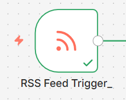

The first node is responsible for monitoring the RSS feed and starting the workflow when a matching item appears.

During refinement, the initial test source was replaced with a more stable official feed:

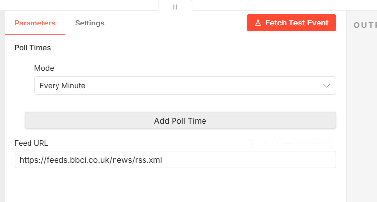

The RSS output returns a fairly complete payload, for example:
- `title`
- `link`
- `pubDate`
- `content`
- `contentSnippet`
- `isoDate`

This makes it a very suitable input source for AI.

### 4.2. Code node

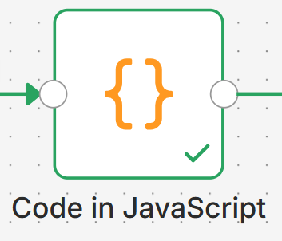

Raw RSS data often contains many keys that are unnecessary for a summarization workflow. Instead of sending the full payload to the model, the workflow uses a Code node to reduce the data.

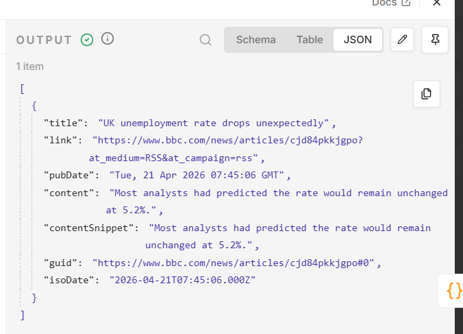

Current logic:
- take the first item from the input dataset,
- keep only the important fields,
- normalize the date and content so downstream nodes can use them more easily.

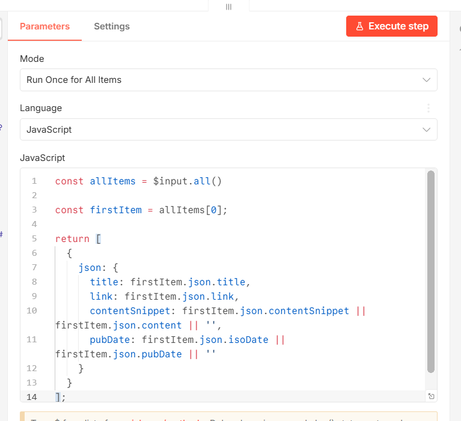

The output will look like this:

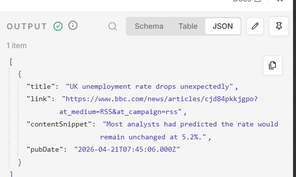

### 4.3. AI node via Ollama

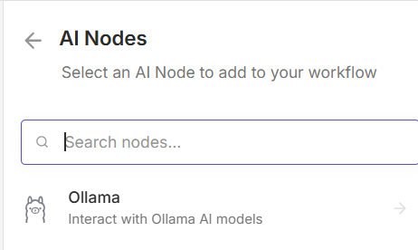

After the data is cleaned up, the AI node receives the normalized input and summarizes the content.

This workflow uses **self-hosted Ollama**, so it only needs:
- the IP address or hostname of the Ollama server,
- the default port `11434`,
- no API key.

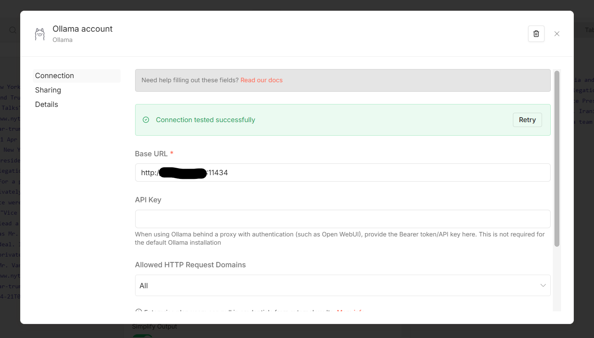

Model used for testing:
- `qwen2.5-coder:0.5b`

This is a lightweight model, suitable for quickly testing the end-to-end flow, trading off some output quality for faster response time.

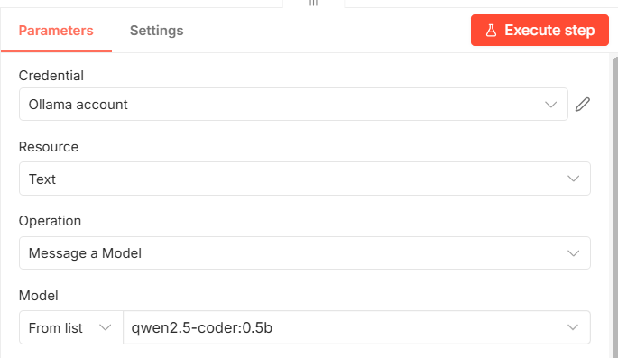

The English prompt was adjusted to stay consistent with the news source:

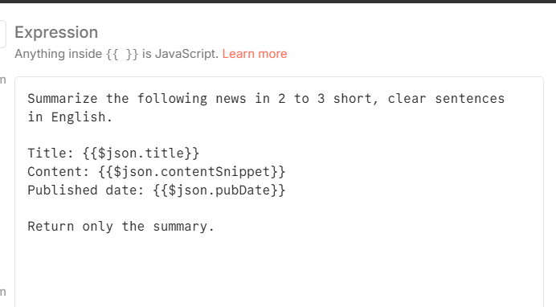

With this configuration, the AI node returns a compact output, mainly a single field:

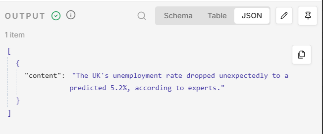

This makes it easier for the Telegram node to map the data.

### 4.4. Telegram node

The final node receives the AI output and sends it to Telegram through a personal bot.

Before using this node, you need to prepare:
- create a bot with `@BotFather`,

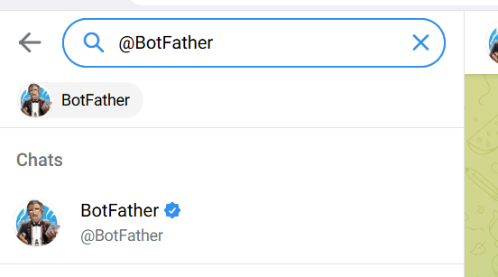

- get the bot token,
- get your personal chat ID through `@userinfobot`.

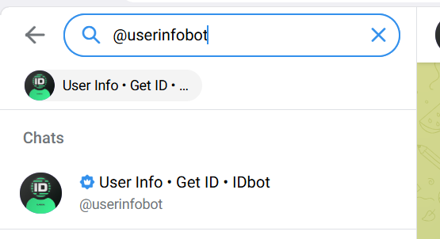

Once you have the required information, you only need to configure the Telegram node and map the content to send.

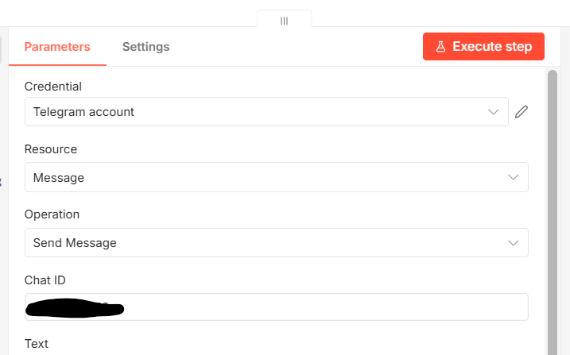

The correct mapping in the current flow is:
- summary from the AI node: `{{$json.content}}`
- title, link, and pubDate can be pulled again from the Code node using node reference syntax.

Example of the final message:

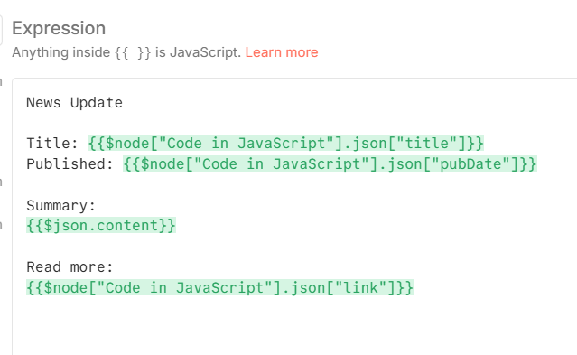

Check whether the Telegram notification has arrived:

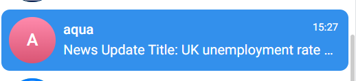

View the detailed content:

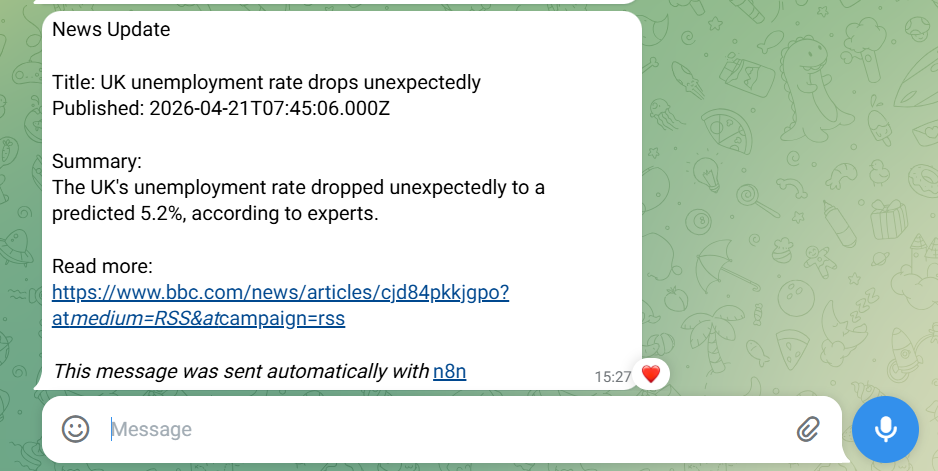

## 5. One important trigger detail: “Every Minute” does not mean spamming every minute

One easy misunderstanding when first using n8n is the `Poll Times` setting.

In this workflow, `Mode = Every Minute` means:
- every minute, the RSS node **checks** the feed once,
- but the flow only continues and sends a Telegram message when there is a matching new item.

It does **not** mean the same article will be sent again every minute.

After enabling the workflow and monitoring the **Executions** section, the system showed multiple successful runs over time. This confirms that:
- the trigger is working,
- the self-hosted workflow is running stably in the background,
- the end-to-end flow from RSS to Telegram is complete.

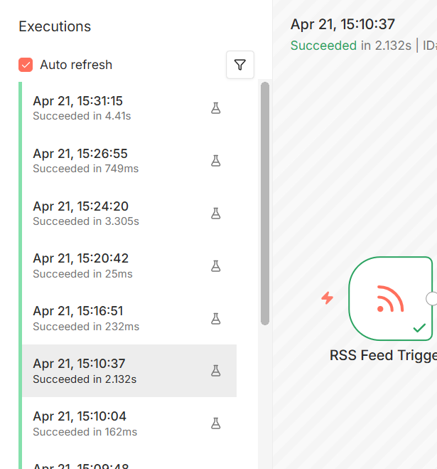

## 6. Next Iterations

Once the basic flow is stable, it can be extended in several directions:

- **Fetch more articles:** instead of only using `firstItem`, use `slice(0, 3)` to process the latest 3 articles.
- **Improve Telegram formatting:** add bullets, emoji, or clearer message blocks.
- **Switch RSS sources by topic:** business, technology, world news, and more.
- **Add a filter node:** only send articles containing specific keywords.
- **Add storage/logging:** keep a record of sent articles to proactively avoid duplicates.
- **Switch to Schedule Trigger:** if you want to force the workflow to run on a schedule, even when there are no new items.

## 7. Conclusion

This workflow achieved its original practice goal:
- using self-hosted n8n to connect multiple nodes,
- pulling data from a real RSS feed,
- processing JSON with JavaScript,
- calling a local AI model through Ollama,
- and sending the result to Telegram.

More importantly, it helps make the structure of a modern automation workflow much clearer: **input source -> data processing -> AI -> delivery channel**.

This is a strong foundation for learning more advanced flows later, such as chatbots, content pipelines, alerting systems, or AI agent orchestration.
